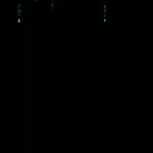

<h1 align="center">CAM-DUMPER</h1>
<p align="center"></p>
<p align="center">Take webcam shots from target by just sending a malicious link</p>


# How it works?
<p>The tool generates a malicious HTTPS page using Serveo or Ngrok Port Forwarding methods, and a javascript code to cam requests using MediaDevices.getUserMedia. </p>

<p>The MediaDevices.getUserMedia() method prompts the user for permission to use a media input which produces a MediaStream with tracks containing the requested types of media. That stream can include, for example, a video track (produced by either a hardware or virtual video source such as a camera, video recording device, screen sharing service, and so forth), an audio track (similarly, produced by a physical or virtual audio source like a microphone, A/D converter, or the like), and possibly other track types. </p>

[See more about MediaDEvices.getUserMedia() here](https://developer.mozilla.org/en-US/docs/Web/API/MediaDevices/getUserMedia)

## Server?


<p> with server Ngrok
<p> I'm sorry to provide 1 server. 
<p> because another server is under repair


## Installing (Kali Linux/Termux):


```
$ apt update && apt upgrade
$ apt install git php wget curl jq
$ git clone https://github.com/SuryaN03/Cam-darkNew.git
$ cd Cam-darkNew
$ chmod +x camdumper.sh
$ ./camdumper.sh atau bash camdumper.sh
```

<p> Termux users should install <a href="https://play.google.com/store/apps/details?id=me.zhanghai.android.files">  MATERIAL FILES  </a> app from playstore for easy managing captured files.</p> 

<b>happy hacking : ]<b>


## TextOn


https://user-images.githubusercontent.com/99640009/163928347-fa74ab3f-3e7e-40de-996f-b49e58764bfd.mp4


## WHOAMI ?

https://user-images.githubusercontent.com/99640009/163899325-4d29c38c-5bb5-4564-95c8-3cdc44896ae9.mp4


## SUPPORT [♡]

[](https://sociabuzz.com/suryan3)

